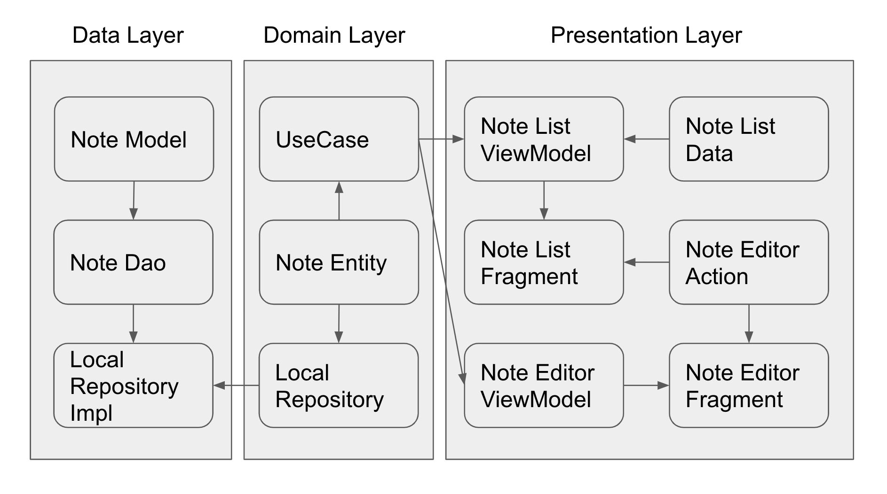

# RakutenTest

<pre>
Rakuten Symphony Korea Technical Assignment for iOS/Android Developers

Guidelines
•	Carefully review the assignment and faithfully implement the requirements.
•	You are free to use any necessary libraries.
•	Language for iOS: Swift
•	Language for Android: Kotlin

Assignment
Please develop a simple note-taking app.

Basic Requirements
•	Users can create a new note.
•	Each note contains following elements:
o	Subject
o	Body: Plain text or your own format
o	Date the note was created or modified
•	The app shows notes made by the user in the list.
•	Users can edit their notes.
•	All notes should be stored on the device.

Detailed Screen Descriptions
Screen 1: Note List 
•	Display a list of notes.
o	Each item in the list represents a note.
o	Each item shows following elements:
	Date
	Subject
•	Features
o	Add
	Create a new note
	Navigate to the Editor (Screen 2)
o	Edit
	Click an item in the list to edit the note.
	Navigate to the Editor (Screen 2)
o	Multiselect and Delete
	Select multiple items in the list.
	Delete selected notes.
o	Sort
	Sort the list in ascending or descending order of date. 
	Sort the list in ascending or descending order of subject. 

Screen 2: Note Editor
•	Navigate to this screen when a user creates or edits a note.
•	Features
o	Edit subject of the note
o	Edit body of the note
o	Cancel editing and navigate to Note List (Screen 1)
o	Save the note and navigate to Note List (Screen 1)
</pre>

## Architecture

* [NoteModel.kt](data/src/main/java/com/jhyun/rakuten/data/local/model/NoteModel.kt)
> Entity that stores note information using the room library

* [LocalRepositoryImpl.kt](data/src/main/java/com/jhyun/rakuten/data/LocalRepositoryImpl.kt)
> Implements domain’s LocalRepository

* [LocalRepository.kt](domain/src/main/java/com/jhyun/rakuten/domain/LocalRepository.kt)
> Repository abstraction for accessing local data

* [NoteEntity.kt](domain/src/main/java/com/jhyun/rakuten/domain/entity/NoteEntity.kt)
> A collection of note data that is expected to have little change between the data layer and the presentation layer.

* [CreateNoteUseCase.kt](domain/src/main/java/com/jhyun/rakuten/domain/usecase/CreateNoteUseCase.kt)
* [GetNoteUseCase.kt](domain/src/main/java/com/jhyun/rakuten/domain/usecase/GetNoteUseCase.kt)
* [GetNotesUseCase.kt](domain/src/main/java/com/jhyun/rakuten/domain/usecase/GetNotesUseCase.kt)
* [UpdateNoteUseCase.kt](domain/src/main/java/com/jhyun/rakuten/domain/usecase/UpdateNoteUseCase.kt)
* [RemoveNotesUseCase.kt](domain/src/main/java/com/jhyun/rakuten/domain/usecase/RemoveNotesUseCase.kt)
> Business logic for connection between data layer and presentation layer

* [NoteListFragment.kt](app/src/main/java/com/jhyun/rakuten/ui/note/NoteListFragment.kt)
* [NoteListViewModel.kt](app/src/main/java/com/jhyun/rakuten/ui/note/NoteListViewModel.kt)
> To enter selection mode, long-click on a note item. The long-clicked note is selected.
> If you sort during selection mode, selection mode is canceled.

* [NoteEditorFragment.kt](app/src/main/java/com/jhyun/rakuten/ui/note/editor/NoteEditorFragment.kt)
* [NoteEditorViewModel.kt](app/src/main/java/com/jhyun/rakuten/ui/note/editor/NoteEditorViewModel.kt)
> To enter edit mode, click the edit button at the top.
> If you press the back button while editing, a alert will appear.

# Library

* dagger hilt
* navigation
* data binding
* room
* gson

---

* mockito
* kotest
